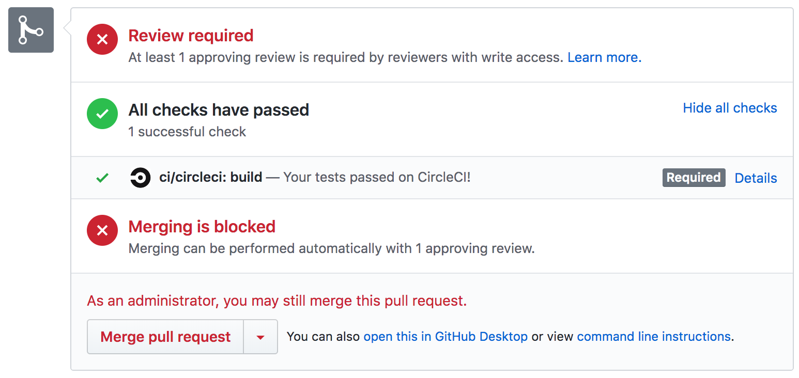

<p align="center">
  
</p>
<p align="center">
  <a href="https://github.com/kids-first/kf-model-fhir/blob/master/LICENSE"></a>
  <a href="https://circleci.com/gh/kids-first/kf-model-fhir"></a>
</p>

# 🔥 Kids First FHIR Data Model

This is an experimental repository for developing the Kids First
FHIR data model for FHIR version R4.

## FHIR 101 - A Practical Guide

If you have never heard of FHIR, are unfamiliar with how to implement FHIR,
or are confused by any of the terms in this README, then
checkout the [FHIR 101 Jupyter Notebook](https://github.com/fhir-sci/fhir-101).

## Quickstart
This repository contains:
1. Kids First FHIR Data Model - the conformance and example resource files
2. Kids First Data Model Docs Site - The HTML/CSS/JavaScript files needed to
   generate a Jekyll documentation site for the model. This is also known as
   a `FHIR Implementation Guide` (IG).
3. Python (3.7) based CLI tool that has commands to make it easier to validate
   the FHIR data model, add resources to the docs site, convert between json/xml,
   and publish resources to a FHIR server.

### Installation
1. Git clone this repository

```bash
$ git clone git@github.com:kids-first/kf-model-fhir.git
$ cd kf-model-fhir
```

2. Setup a Python virtual environment

```bash
# Create virtualenv
$ python3 -m venv venv

# Activate virtualenv
$ source ./venv/bin/activate
```

3. Install the Python CLI tool

```bash
$ pip install -e .
```
Test the installation by running the CLI: `fhirmodel -h`. You should see
something that contains:
```
Usage: fhirmodel [OPTIONS] COMMAND [ARGS]...

  A CLI utility for validating FHIR Profiles and Resources
```

4. Install Docker CE: https://docs.docker.com/install/

Docker is needed because the CLI executes the model validation
inside a Dockerized version of the HL7 IG Publisher.

### Run Validations
The resource files that make up the FHIR data model are enclosed inside the
resources subdirectory: `./site_root/input/resources`.

1. Add a new conformance resource

    `./site_root/input/resources/profiles/<resource file>`

2. Add a new example resource to test the conformance resource

    `./site_root/input/resources/examples`

3. Validate the models

   ```shell
   # Method 1 - Uses the dockerized IG publisher
   fhirmodel validate ./site_root/ig.ini --publisher_opts='-tx n/a'

   # Method 2 - Uses native IG publisher - faster than above method
   fhirmodel add ./site_root/input/resources
   java -jar org.hl7.fhir.publisher.jar -ig site_root/input/resources/ig.ini -tx n/a
   ```

## Develop
This repository provides a Python based CLI and process for working through the
[FHIR model development](https://hub-binder.mybinder.ovh/user/fhir-sci-fhir-101-hk2fpjkz/notebooks/FHIR%20101%20-%20Practical%20Guide.ipynb#Model-Development) and
[documentation process](https://hub-binder.mybinder.ovh/user/fhir-sci-fhir-101-hk2fpjkz/notebooks/FHIR%20101%20-%20Practical%20Guide.ipynb#Model-Documentation).

### Version Control
Similar to other Kids First code repository, this repository will use Git flow
for collaborative code development and version control.  Please review
the [Kids First Developer Handbook](https://kids-first.github.io/kf-developer-handbook/development/feature_lifecycle.html) if you are not familiar with this.

### Naming Conventions
All resource files in the model will follow the naming convention: `<resource type>-<resource id>.json`
Please see the Kids First [naming conventions doc](https://github.com/kids-first/kf-model-fhir/tree/master/docs/naming_conventions.md) for detals.

### Repository Layout

- Source code for CLI: `kf_model_fhir`
- Source files for IG: `site_root`

```
site_root
├── ig.ini                                     -> IG configuration file
├── input
│   ├── ImplementationGuide-KidsFirst.json     -> IG resource file
│   └── resources
│       ├── examples                           -> Example resources
│       ├── extensions                         -> Extensions
│       ├── profiles                           -> StructureDefinition (non-Extension)
│       ├── search                             -> SearchParameters
│       └── terminology                        -> CodeSystems, ValueSets
```

### ImplementationGuide Files
The files `ig.ini` and `ImplementationGuide-KidsFirst.json` contain
configuration information for the IG and affect which resources are validated
and included in the generated site.
Read more about them [here](https://build.fhir.org/ig/FHIR/ig-guidance/index.html)
and [here](http://www.hl7.org/fhir/implementationguide.html)

### Conformance Resources
You can use any tool to develop a conformance resource (Forge, cimpl, etc.),
but for example purposes just create a JSON file in the conformance resource
directory:

 `./site_root/input/resources/profiles/StructureDefinition-study.json`

with the following content:
```json
{
    "resourceType": "StructureDefinition",
    "id": "study",
    "url": "http://fhir.kids-first.io/StructureDefinition/study",
    "version": "0.1.0",
    "name": "Study",
    "title": "Study",
    "status": "draft",
    "publisher": "Kids First",
    "description": "A research study within the Kids First ecosystem",
    "fhirVersion": "4.0.0",
    "kind": "resource",
    "abstract": false,
    "type": "ResearchStudy",
    "baseDefinition": "http://hl7.org/fhir/StructureDefinition/ResearchStudy",
    "derivation": "constraint",
    "differential": {
        "element": [
            {
                "id": "ResearchStudy",
                "path": "ResearchStudy"
            },
            {
                "id": "ResearchStudy.phase",
                "path": "ResearchStudy.phase",
                "max": "0"
            },
            {
                "id": "ResearchStudy.arm",
                "path": "ResearchStudy.arm",
                "max": "0"
            }
        ]
    }
}
```

### Example Resources
Next create an example resource in the example resources directory:

`./site_root/input/resources/examples/ResearchStudy-sd-001.json`

with the following content:

```json
{
    "resourceType":"ResearchStudy",
    "id": "sd-001",
    "meta": {
        "profile": ["http://fhir.kids-first.io/StructureDefinition/study"]
    },
    "status": "completed",
    "title": "Study of Ewing's Sarcoma"
}
```
### Validate the Model
To validate the resources you just created:

```shell
# Method 1 - Uses the dockerized IG publisher
fhirmodel validate ./site_root/ig.ini --publisher_opts='-tx n/a'

# Method 2 - Uses native IG publisher - faster than above method
fhirmodel add ./site_root/input/resources
java -jar org.hl7.fhir.publisher.jar -ig site_root/input/resources/ig.ini -tx n/a
```

### Validation Results
The CLI will log output to the screen and tell you whether validation succeeded
or failed. You can view detailed validation results at `./site_root/output/qa.html`

### Log Level
To change the log level go to `kf_model_fhir/config.py` and change it like so:

```python
DEFAULT_LOG_LEVEL = logging.DEBUG
```
Read more about [Python logging levels here.](https://docs.python.org/3.7/library/logging.html#logging-levels)

## Publish the Model

Many FHIR data models in the FHIR ecosystem use [Simplifier](https://simplifier.net/)
as a platform for publishing and distributing their data model. Simplifier
also provides some nice views of the conformance resources which show
how they differ from the base resource they are extending. This can be
very useful for debugging.

### Create a Simplifier Account + Project
Each developer will need their own Simplifier account and project if they want
to publish their data model files for debugging/viewing:

1. Go to `http://www.simplifier.net` and create an account
2. Login to your account and create a Simplifier project
    - You must use FHIR version: R4

### Push to Your Simplifier Project
Publish both the conformance resources and example resources to Simplifier
```
fhirmodel publish ./site_root/input/resources/profiles --username=$SIMPLIFIER_USER --password=$SIMPLIFIER_PW --base_url=<your server>
fhirmodel publish ./site_root/input/resources/examples --username=$SIMPLIFIER_USER --password=$SIMPLIFIER_PW --base_url=<your server>
```

### Pull Requests
You should already have a local git branch (e.g. add-biospecimen-profiles-resources)
that you've been periodically committing to and pushing up to Github. At this point
you're ready to get your code merged into the master branch of the git repository.  

Go ahead and make a Pull Request on Github to merge your feature branch into
the master branch. If you're not quite ready for it to be reviewed, you can
make it a [Draft Pull Request](https://help.github.com/en/articles/about-pull-requests#draft-pull-requests).

Once all status checks have passed, request review(s) from other
model developers. You need at least 1 approving review to merge your PR.

### Continuous Integration
Notice the status checks section of the Pull Request:
<p align="center">
  
</p>

Every pull request must pass all of the status checks before it is eligible for
merging. For this repository there is only one status check: every time you
push a commit, the continuous integration that has been setup runs conformance resource and
resource validation for the model using the same Python CLI tool you've been using.

We use CircleCI for our CI solution.
If you click on the "Details" link next to `ci/circleci: build` text, you can
see a more detailed view of the CI output on CircleCI.

### Publish to the Kids First Simplifier Project
Once you have an approving review and all status checks have passed you may
merge your Pull Request. Once again, CI will run but this time on the master
branch (since its been updated with your code).

Any time CI runs on the master branch it will do one additional step. If
validation passes, it will publish all of the conformance resource and resource files
in the `./site_root/source` directory to the
[Kids First R4 Simplifier Project](https://simplifier.net/kidsfirstr4).
