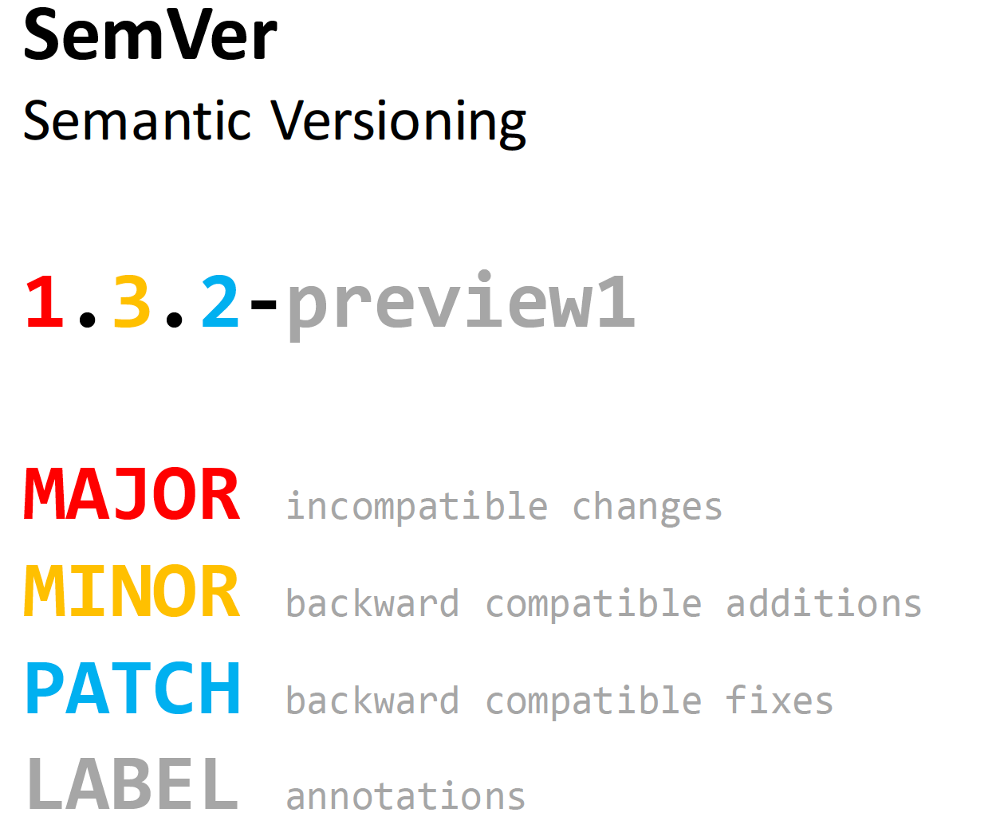

# Kids First DRC FHIR Model Release Specification

## Background
In software development, a release is usually a package of source code with a
version which identifies a logical set of content having specific compatibility
characteristics. A software release is used to distribute code to end users.

In FHIR model development a release is very similar to a software release. It
is a logical set of conformance resources distributed in a package with a
version that identifies the set of resources and their compatibility characteristics.

The FHIR specification includes a
[packaging specification](https://confluence.hl7.org/display/FHIR/NPM+Package+Specification)
which uses NPM packages to distribute the model. When the IG publisher runs,
it produces the NPM package in the user's FHIR package cache at `~/.fhir/packages`
containing the conformance resources from the FHIR model.

<p align="center">

</p>

The FHIR packaging specification is still under development and does not have
a fully fleshed-out release process, but we can still use the versioning,
package naming, etc. guidelines in the specification as a basis for the
Kids First DRC release specification.

## Versioning
We will follow the FHIR NPM package specification's versioning scheme which
uses [Semantic Versioning](https://semver.org/) to determine version numbers
for FHIR model releases:



### Examples

1. Create first FHIR model release        -> version `0.1.0`
2. Create new StructureDefinition(s)      -> version `0.2.0`
3. Remove a StructureDefinition           -> version `1.0.0`
4. Change StructureDefinition.id          -> version `2.0.0`
5. Fix typo in StructureDefinition.title  -> version `2.0.1`

## Release Overview

Kids First DRC FHIR model releases will be managed by Github releases and tags
on a `release` branch. The NPM package containing the FHIR model will be
an additional release asset that is part of the Github release.

Here is an overview:

<p align="center">

</p>


## Pre-Release

1. Developer creates a feature branch: `add-specimen-conf-resources`
2. Developer authors the Specimen conformance resources
   (`StructureDefinition`, `CodeSystem`, `ValueSet`, etc.) and commits locally
3. Developer runs HL7 FHIR validation on local resources - it passes
4. Developer pushes changes to remote branch on GitHub
5. Continuous Integration (CI) pipeline runs:
    - Unit tests: the same HL7 FHIR validation as in step 3.
    - Integration test(s): load FHIR model resources (conformance and example)
      into the integration test FHIR server.
    - Data migration test(s): if a model change will invalidate data in
    production, a data migration will be required and must be tested before
    running in production.
    - CI pipeline successfully completes.
6. Developer makes Pull Request for the team to review
7. Team reviews and approves the Pull Request
8. Developer merges feature branch into `master` branch

### Testing

The steps in the [Pre-Release](#Pre-Release) include a rigorous testing process
which includes unit tests and integration tests (read further for details) so
that there is a very low chance of failure or issues with the FHIR model
resources themselves when the FHIR model is deployed to the production FHIR
server.

This helps ensure that clients and users of the FHIR services in production
will have a high quality experience with minimum bugs in the FHIR model.

## Release Process

## Executed by `fhirmodel release` command

A new CLI command will be added to facilitate the release of the FHIR model

```shell
# Command spec
$ fhirmodel release <IG control file> <version type>

# Example
$ fhirmodel release site_root/ig.ini minor
```

When this command is run, the following steps will be executed:

1. **Generate the next release version number**

    - CLI will use the last release's version number and the version type
    to generate the next version number

2. **Prep conformance resources for release**

    - The `version` attribute on all conformance resources will be populated
      with the new version number.
    - The `publisher` attribute on all conformance resources with the
      Kids First DRC canonical URL will be populated with value in
      `ImplementationGuide.publisher`
    - The `contact` attribute on all conformance resources with the
      Kids First DRC canonical URL will be populated with appropriate information
    - The `date` attribute on all conformance resources will be populated with
      the current date.

3. **Produce the NPM package for the model**

    - Run the IG publisher to produce the NPM package for the model
    - Create a tarball of the NPM package

4. **Update `CHANGELOG.md` with release notes**

    - Generate release notes using titles of Git Pull Requests merged into
      `master` branch since last release
    - See [current Kids First release maker](https://github.com/kids-first/kf-release-maker/tree/refactor-release-maker) for an example.

5. **Create a release-version branch and Pull Request**

    - Create a release-version branch off of `master`: `release-<version number>`
    - Create a Pull Request to merge this branch into `release` branch
    - Set the PR description to the release notes markdown

## Executed by FHIR modeling team

6. **Team must review and approve the Pull Request**

    - The only FHIR model resource changes to review at this point will be
      those made in [Release Process step 2](#Release-Process).

    - The team must also review the release note changes in `CHANGELOG.md`
      to make sure all desired changes are included.

## Executed by CI pipeline

7. **Create Github Release**
    - On merge of release-version branch into `release` branch,
      create the Github release
    - Attach the NPM package tarball as a release artifact

8. **Publish the IG site**
    - On merge of release-version branch into `release` branch,
      trigger the IG site publishing process so that IG Github pages site is
      updated with the released conformance resources.


## Deployment

### Steps

1. On a merge into the release branch, the following happens:
    - FHIR model's conformance resources and example resources are deployed
      to an integration test FHIR server.
    - Run any data migration tests on the integration test FHIR server
3. If test deployment fails for any reason, go back to step 1 of
   [Pre-Release](#Pre-Release)
3. If the deployment to the integration test server is successful:
    - Deploy the conformance resources to the production server
    - Run any data migrations
4. Deployment to production could automatically be triggered on successful
   deployment to integration test server OR it could be a separate process
   triggered manually when we are ready to update the model in the production
   server.
